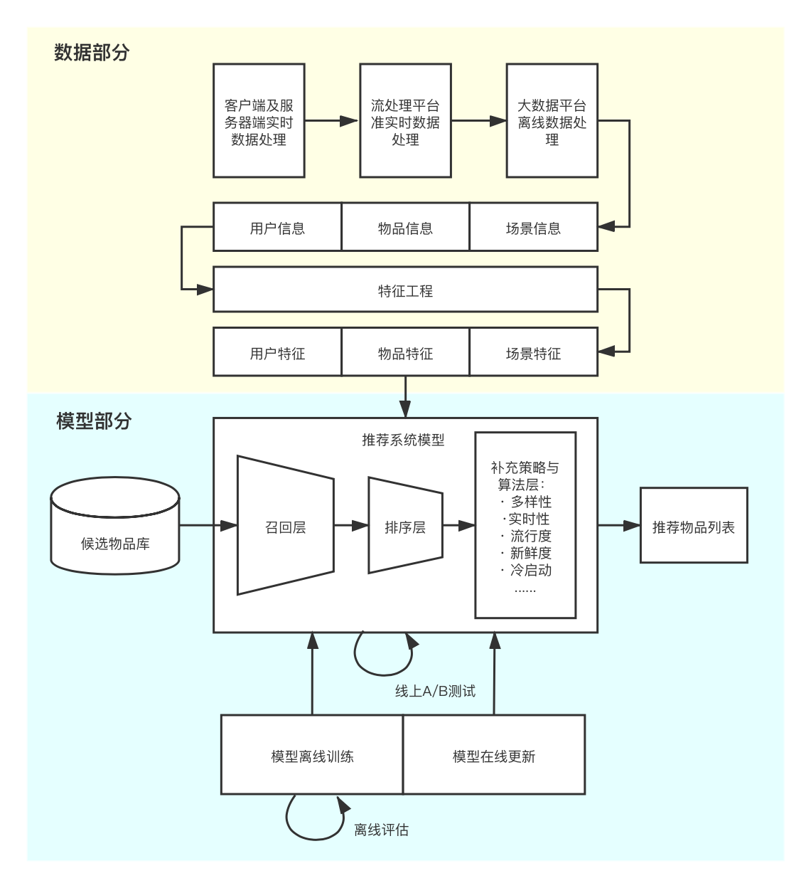

[toc]
# 介绍语
**分享者：史宏炜 周心怡**

**日期：2020年09月05日**

作为个性化时代互联网的核心应用技术，推荐、搜索和广告一直是工业界技术研发与创新的主战场，也是巨头公司如谷歌、亚马逊、阿里巴巴等重兵投入打造的技术护城河。

这是一个生活处处被推荐系统影响的时代。想上网购物，推荐系统会帮你挑选满意的商品；想了解资讯，推荐系统会为你准备感兴趣的新闻；想学习充电，推荐系统会为你提供适合你的课程；想消遣放松，推荐系统会为你奉上让你欲罢不能的短视频；想闭目养神，推荐系统会给你播放应景的音乐，可以说，推荐系统从来没有像现在这样影响着人们的生活。

当我们打开手机app，会发现推荐无处不在：从淘宝、京东、拼多多等电商，到美团、大众、饿了么等本地生活。在抖音、快手、B站等泛娱乐化平台，推荐系统是其“中流砥柱”，是吸引用户、提升用户留存的关键。本次我们主要结合一些简单案例介绍推荐系统的主要架构和基本算法的原理，在具体数据上用Python进行算法的实现。

# 推荐系统介绍

## 什么是推荐系统

* 维基百科的定义：推荐系统是一种**信息过滤系统**，用于预测用户对物品的评分或偏好。

> 我们可以换个角度来理解：
> 
>> **它能做什么？**
>> 它可以把那些最终会在**用户和物品之间**产生的**连接**找出来。世间的万事万物都有连接，人与人之间的社会连接促进了社交产品的诞生，人与商品之间的消费连接造就了无数的电商产品，人和资讯越来越多的阅读连接促使了各类信息流产品的出现。
> 
>> **它需要什么？**
>> 推荐系统**需要已经存在的连接**，**去预测未来的连接**。比如电商平台会根据你买过什么，浏览过什么这些人和商品之间的连接来预测你还可能会买什么，又比如你在使用今日头条时每一次点击，每一次阅读都是连接，根据已有过去的点击、浏览行为来预测你感兴趣的内容。
> 
>> **它是怎么做的呢？**
>> 维基百科的定义已经解释了：**预测用户评分和偏好**，他们对应了推荐系统背后相关算法和技术的两大类别，还有更抽象的分类：机器推荐和人工推荐，也是我们常说的个性化推荐和编辑推荐。
> 
>> **它解决的是什么问题？**
>> 信息过载和长尾问题(长尾理论)。随着信息技术和互联网的发展，人们逐渐从信息匮乏的时代走入了**信息过载**的时代。消费者想从大量信息(物品)中找到自己感兴趣的信息，信息生产者想让自己生产的信息脱颖而出从而得到关注都是一件很难的问题
>> 
>> 推荐系统的任务就是连接用户和信息(物品)。同时推荐系统要解决的另一个问题是需要**发掘用户的行为**，找到用户的**个性化需求**，从而将长尾商品准确的推荐给需要它的用户，同时帮助用户发现那些他们感兴趣但是很难发现的商品。

* 常见的推荐栏位例如：淘宝的猜你喜欢、看了又看、推荐商品，美团的首页推荐、附近推荐等。

* 推荐系统是比较偏向于**工程类**的系统，要做得更加的精确，需要的不仅仅是推荐算法，还有用户意图识别、文本分析、行为分析等，是一个综合性很强的系统。

## 推荐系统的作用和意义

* 推荐系统的作用和意义可以从用户和公司两个角度来阐述：

1. **用户角度**：推荐系统解决在“信息过载”的情况下，用户如何高效获取感兴趣信息的问题。
  
	> 互联网拥有海量的信息，因此互联网可以说是推荐系统的最佳应用场景，在用户的角度来看，推荐系统是在用户需求并不十分明确的情况下进行信息的过滤，与搜索系统（用户会输入明确的“搜索词”）相比，推荐系统更多的利用用户的各类历史信息“猜测”其可能喜欢的内容。

2. **公司角度**：推荐系统解决产品能够最大效率地吸引用户、留存用户、增加用户黏性、提高用户转化率的问题，从而达到公司商业目标连续增长的目的。
  
	> 不同业务模式的公司定义的具体推荐系统优化目标不同。例如视频类公司更注重用户的观看时长；电商类公司更重视用户的购买转化率（CVR），新闻类公司更注重用户的点击率等。

## 推荐系统的架构

* 推荐系统要解决的“用户痛点”是用户如何在“信息过载”的情况下高效地获得感兴趣的信息，这就是推荐系统要解决的基础问题：即推荐系统要**解决“人”和“信息”的关系**。
> 这里的“信息”，在商品推荐中指“商品信息”，视频推荐中指“视频信息”，新闻推荐中指“新闻信息”，等等这些可以统称为**物品信息**。
> 
> 与人相关的信息，包括历史行为，人口属性，关系网络等，这些统称为**用户信息**。
> 
> 在一些具体的推荐场景中，用户的最终选择受时间、地点、用户的状态等一系列环境信息的影响，成为**场景信息**或**上下文信息**。

### 推荐系统的逻辑框架

* 推荐系统要处理的问题可以较形式化地定义为：对于用户 $U$ (user)，在特定场景 $C$ (context) 下，针对海量的物品信息，构建一个函数 $f(U,I,C)$，预测用户对特定候选物品 $I$ (item) 的喜好程度，再根据喜好程度对所有候选物品进行排序，生成推荐列表的问题。
* 可以得到抽象的推荐系统逻辑框架：

### 推荐系统的技术架构
* 在实际的推荐系统中，工程师需要将抽象的概念和模块具体化、工程化，在构建好逻辑框架的基础上，工程师们需要着重解决的问题有两类：

	1. **数据和信息相关的问题**：即用户信息，物品信息和场景信息分别是什么？如何存储、更新和处理？
	2. **推荐系统算法和模型相关的问题**：推荐模型图和训练、如何预测、如何达成更好的推荐效果？

以下是推荐系统的技术架构示意图：

以下是推荐系统详细架构：

#### 推荐系统的数据部分

* 推荐系统的数据部分主要负责**用户**、**物品**、**场景**信息的收集和处理。
* 负责数据收集与处理的三种平台按照实时性的强弱顺序排序，依次是：
    $\circ$ 客户端及服务器端实时数据处理
    $\circ$ 流处理平台准实时数据处理
    $\circ$ 大数据平台离线数据处理
* **实时性由强到弱**递减的同时，三种平台的海量数据**处理能力由弱到强**。

> 得到原始数据信息后，推荐系统的数据处理系统会将原始数据进一步加工，加工后的数据出口主要有三个：
> 1. 生成推荐模型所需的样本数据，用于**算法模型的训练和评估**；
> 2. 生成推荐模型服务（model serving）所需的“特征”，用于**推荐系统的线上推断**；
> 3. 生成系统监控、商业智能（Business Intelligence，BI）系统所需的**统计型数据**。

#### 推荐系统的模型部分

* **模型部分**是推荐系统的**主体**，模型的结构一般是由**召回层**、**排序层**、**补充策略与算法层**组成。
> *<u>召回层</u>*：一般利用高效的召回规则、算法或者简单的模型，快速从**海量的候选集**中召回用户可能感兴趣的物品。
> 
> *<u>排序层</u>*：利用排序模型对初筛的候选集进行**精排序**。
> 
> *<u>补充策略与算法层</u>*：也称为**再排序层**，在推荐列表返回用户之前，为兼顾结果的多样性、流行度、新鲜度等指标，结合一些补充的策略和算法对推荐列表进行一定的**调整**，最终推荐给用户。

* 在模型服务之前，需要通过**模型训练**确定模型的结构、结构中不同参数权重的具体数值，以及模型相关算法和策略中的参数取值。
> 模型训练根据训练环境不同分为：**离线训练**和**在线训练**
>> **离线训练：** 特点是可以利用全量样本和特征，是模型逼近全局最优点
>> 
>> **在线训练：** 可以实时地“消化”新的数据样本，更快地反映新的数据变化趋势，满足模型实时性的需求。

* 为了**评估推荐模型的效果**，方便模型的迭代优化，推荐系统的模型部分提供了**离线评估**和**线上A/B测试**等多种评估模块，得出**线下和线上评估指标**，指导下一步模型的迭代优化。

## 推荐系统进化之路

* 推荐系统的发展可谓是一日千里，从2010年之前千篇一律的协同过滤 (Collaborative Filtering, CF)、逻辑回归 (Logistic Regression, LR)，进化到因子分解机 (Factorization Machine, FM)、梯度提升树 (Gradient Boosting Decision Tree, GBDT)，再到2015年之后深度学习推荐模型的百花齐放，各种模型框架层出不穷。
* 即使在深度学习空前流行的今天，协同过滤、逻辑回归、因子分解机等传统推荐模型仍凭借其
    $\circ$**可解释性强**、**硬件环境要求低**、**易于快速训练和部署**等不可替代的优势，拥有大量适用的应用场景；
    $\circ$ 并且**传统推荐模型是深度学习推荐模型的基础**；
  因此我们这里主要介绍**传统推荐系统**的演化之路。

* 首先为大家展示传统推荐模型的演化关系图，作为我们整个介绍的索引：

* 推荐系统的发展脉络主要有以下几部分：

**1. 协同过滤算法族**

> $\circ$ 从物品相似度合用户相似度的角度出发，协同过滤衍生出**物品协同过滤 (ItemCF)** 和**用户协同过滤 (UserCF)**
> $\circ$ 为了使协同过滤能够更好地**处理稀疏共现矩阵问题、增强模型泛化能力**，从协同过滤衍生出矩阵分解模型 (Matrix Factorization, MF)以及各种分支模型。

**2. 逻辑回归模型族**
> $\circ$ 与协同过滤仅利用用户和物品之间的显式或隐式反馈信息相比，逻辑回归能够利用和**融合更多用户、物品和上下文特征**。

**3. 因子分解机模型族**
> $\circ$ 在传统逻辑回归的基础上，加入了二阶的部分，使模型具备了进行**特征组合**的能力。
> $\circ$ 在因子分解机的基础上发展了**域感知因子分解机** (Field-aware Factorization Machine, FFM)，通过加入**特征域**的概念，进一步**加强因子分解机特征交叉的能力**。

**4. 组合模型**
> $\circ$ 为了**融合多个模型的优点**，将不同模型组合使用是构建推荐模型常用的方法。
> $\circ$ Facebook提出**GBDT+LR组合模型**是在工业界影响力较大的组合方式。
> $\circ$ 组合模型体现出的**特征工程模型化**的思想，也成为深度学习推荐模型的引子和核心思想之一。

# 协同过滤

## 什么协同过滤

* 协同过滤就是协同大家的反馈、评价和意见一起对海量的信息进行过滤，从中筛选出目标用户可能感兴趣的信息的推荐过程。
* 以下是一个例子：

## 模型

* 假设有 $m$ 个用户 $\mathbb{U}=\left\{u_{1}, \cdots, u_{m}\right\}$ 以及 $n$ 个 item $\mathbb{I}=\left\{i_{1}, \cdots, i_{n}\right\}$。每个用户 $u$ 有一个 item 评分列表 $\mathbb{I}_u$，其中 $\mathbb{I}_{u} \subset \mathbb{I}$ 且有可能是空的。
* 给定用户 $u_a \in \mathbb{U}$，协同过滤算法任务包含两种形式：
    $\circ$ **预测**：预测用户 $u_a$ 对于item $i_{j} \notin \mathbb{I}_{u_{a}}$ 的评分 $P_{a,j}$。
    $\circ$ **推荐**：为用户 $u_a$ 推荐他/她可能最喜欢的由 $N$ 个item组成的列表  $\mathbb{I}_{r} \subset \mathbb{I}$，且 $\mathbb{I}_{r} \subset \mathbb{I_{u_a}} = \Phi$。这被称作 `Top-N`推荐。

* 下图给出了协同过滤任务的示意图，协同过滤算法将整个 $m \times n$ 个user-item数据表示为一个评分矩阵 $A$，矩阵中的每一个元素 $a_{i,j}$表示第 $i$ 个user在第 $j$ 个item上的评分。

## UserCF

* 基于用户的协同过滤算法是推荐系统中最古老的算法。可以不夸张地说，**这个算法的诞生标志了推荐系统的诞生**。该算法在**1992年**被提出，并应用于**邮件过滤系统**，1994年被GroupLens用于新闻过滤。在此之后直到2000年，该算法都是推荐系统领域最著名的算法。

> **基于用户的协同过滤算法**
> 当一个用户A需要个性化推荐时，可以先找到和他有相似兴趣的其他用户，然后把那些用户喜欢的、而用户A没有听说过的物品推荐给A。这种方法称为基于用户的协同过滤算法。

* 基于用户的协同过滤算法主要包括两个步骤：
    1. 找到和目标用户兴趣相似的用户集合。（关键就是计算两个用户的兴趣**相似度**）
    2. 找到这个集合中的用户喜欢的，且目标用户没有听说过的物品推荐给目标用户。

* * *

* 随着信息数量和用户规模的剧烈增长，传统的UserCF 面临**两个挑战**：

    1. **可扩展性scalability**：UserCF 能够实时搜索成千上万的相似用户，但是现代系统要求实时搜索千万甚至亿级的相似用户。UserCF 的整体计算复杂度为 $O\left(m^{2} \times \bar{n}\right)$，其中 $\bar{n}$ 为平均每个用户评分的item数量，因此随着用户规模的增加，其计算复杂度难以忍受。
    2. **对于行为丰富的单个用户也存在性能问题**。例如某些用户可能在成千上万个item 上有过行为，那么这批用户会拖慢每秒可以搜索的相似用户的数量（因为计算它们之间的相似度的计算复杂度为 $O(n)$ ），从而进一步降低了可扩展性。
    3. **稀疏性sparsity**：用户需要他们可以信任的推荐，从而帮助他们找到感兴趣的 item。对于质量较差的推荐，用户一般都是“用脚投票”，直接拒绝。由于绝大多数用户有行为的 item 非常稀疏，占比甚至低于 1% ，因此基于 UserCF 的推荐可能无法为用户提供任何有效的推荐，使得推荐的质量非常差。

> 某种程度上这两个挑战是相互冲突的：**算法花费在搜索相似用户的时间上越少，则它的可扩展性越强，但是推荐质量越差**。论文 《Item-Based Collaborative Filtering Recommendation Algorithms》 提出了 **ItemCF** 来同时解决这两个挑战。
> * ItemCF 首先探索 item 之间的相似性，而不是user之间的相似性；然后向用户推荐她/他喜欢的 item 类似的 item 。
> * 因为item之间的关系是**相对静态的**（相对于user之间的关系），所以基于 item 的算法可以预计算item-item相似性，从而**减少在线计算的数量**，同时保持较高的推荐质量。

* * *

> UserCF 的基本思想是：根据其它志趣相投用户的意见来推荐。
> ItemCF 的基本思想是：根据用户之前喜欢过的item来推荐类似的item 。

### 用户相似度计算

**1. 余弦相似度**
余弦相似度衡量的是用户向量 $\bf{i}$ 和用户向量 $\bf{j}$ 之间的向量夹角大小，显然夹角越小，说明余弦相似度越大，两个用户越相似。
$$
\operatorname{sim}(i, j)=\cos (i, j)=\frac{i \cdot j}{\|i\| \cdot\|j\|}
$$

**2. 皮尔逊相关系数**
皮尔逊相关系数通过使用用户平均分对各独立评分进行修正，减少了用户评分偏置的影响。
$$
\operatorname{sim}(i, j)=\frac{\sum_{{p} \in P}\left(R_{{i}, {p}}-\bar{R}_{{i}}\right)\left(R_{{j}, {p}}-\bar{R}_{{j}}\right)}{\sqrt{\sum_{{p} \in P}\left(R_{{i}, {p}}-\bar{R}_{{i}}\right)^{2}} \sqrt{\sum_{{p} \in P}\left(R_{{j}, {p}}-\bar{R}_{{j}}\right)^{2}}}
$$

其中 $R_{{i}, {p}}$ 代表用户 $i$ 对物品 $p$ 的评分，$\bar{R}_{{i}}$ 代表用户 $i$ 对所有物品的平均评分，$P$ 代表所有物品的集合。

> 基于皮尔逊系数的思路，还可以通过引入物品平均分的方式，减少物品评分偏置对结果的影响。
> $$
\operatorname{sim}(i, j)=\frac{\sum_{p \in P}\left(R_{i, p}-\overline{R_{p}}\right)\left(R_{j, p}-\overline{R_{p}}\right)}{\sqrt{\sum_{p \in P}\left(R_{i, p}-\overline{R_{p}}\right)^{2}} \sqrt{\sum_{p \in P}\left(R_{j, p}-\overline{R_{p}}\right)^{2}}}
> $$
> 其中，$\overline{R_{p}}$ 代表物品 $p$ 得到所有评分的平均分。

* 理论上，任何合理的**向量相似度定义方式**都可以作为相似用户计算的标准。

### 用户打分预测结果

* 最常用的方式是利用用户相似度和相似用户的评分的加权平均获得目标用户的评价预测。

$$
R_{{u}, {p}}=\frac{\sum_{{s} \in S}\left(w_{{u}, {s}} \cdot R_{{s}, {p}}\right)}{\sum_{{s} \in S} w_{{u}, {s}}}
$$

其中，$w_{u,s}$ 是用户 $u$ 和用户 $s$ 的相似度，$R_{s,p}$是用户 $s$ 对物品 $p$ 的评分。

## ItemCF
* 基于物品的协同过滤（item-based collaborative filtering）算法是目前业界应用最多的算法。无论是亚马逊网，还是Netflix、Hulu、YouTube，其推荐算法的基础都是该算法。

> **基于物品的协同过滤算法**
> 基于物品的协同过滤算法（简称ItemCF）**给用户推荐那些和他们之前喜欢的物品相似的物品**。
> 
> ItemCF算法并不利用物品的内容属性计算物品之间的相似度，它主要通过分析用户的行为记录计算物品之间的相似度。该算法认为，**物品A和物品B具有很大的相似度是因为喜欢物品A的用户大都也喜欢物品B**。

* 基于物品的协同过滤算法主要分为两步：
    1. 计算物品之间的相似度。
    2. 根据物品的相似度和用户的历史行为给用户生成推荐列表。

### item相似度计算

* ItemCF最关键的步骤之一是如何计算 item之间的相似度。计算item $i, j$ 之间相似度的基本思想是：首先挑选既对 $i$ 打分、又对 $j$ 打分的用户 $\mathbb{U}_{i,j}$ ，然后基于这些用户的打分来计算相似度 $s_{i,j}$。

**1. 余弦相似度**

$$
\operatorname{sim}(i, j)=\cos \left(\overrightarrow{\mathbf{r}}_{\cdot, i}, \overrightarrow{\mathbf{r}}_{\cdot, j}\right)=\frac{\sum_{a \in \mathbb{U}_{i, j}} r_{a, i} \times r_{a, j}}{\sqrt{\sum_{a \in \mathbb{U}_{i, j}} r_{a, i}^{2}} \sqrt{\sum_{a \in \mathbb{U}_{i, j}} r_{a, j}^{2}}}
$$

**2. 皮尔逊相关系数**

$$
\operatorname{sim}(i, j)=\frac{\sum_{a \in \mathbb{U}_{i, j}}\left(r_{a, i}-\bar{r}_{i}\right)\left(r_{a, j}-\bar{r}_{j}\right)}{\sqrt{\sum_{a \in \mathbb{U}_{i, j}}\left(r_{a, i}-\bar{r}_{i}\right)^{2}} \sqrt{\sum_{a \in \mathbb{U}_{i, j}}\left(r_{a, j}-\bar{r}_{j}\right)^{2}}}
$$

其中 $\bar{r}_{i} 为item $i$ 在 $\mathbb{U}_{i,j}$上的打分均值，$\bar{r}_{j} 为item $j$ 在 $\mathbb{U}_{i,j}$上的打分均值

**3. 修正皮尔逊相关系数**

* 基于余弦的相似度有个缺陷：未考虑不同用户之间的打分差异。修正余弦相似度通过从每个用户的打分中减去该用户的打分均值来修复这个问题：

$$
\operatorname{sim}(i, j)=\frac{\sum_{a \in \mathbb{U}_{i, j}}\left(r_{a, i}-\bar{r}_{a}\right)\left(r_{a, j}-\bar{r}_{a}\right)}{\sqrt{\sum_{a \in \mathbb{U}_{i, j}}\left(r_{a, i}-\bar{r}_{a}\right)^{2}} \sqrt{\sum_{a \in \mathbb{U}_{i, j}}\left(r_{a, j}-\bar{r}_{a}\right)^{2}}}
$$

其中 $\bar{r}_{a}$ 是用户 $a$ 在他/她所有打分item上的打分均值。

### 用户打分预测结果

这里我们考虑两种技术：

1. **加权和 `weighted sum`**

* 该方法通过用户已经评分的item中，根据和 $i$ 的相似度进行加权得到预测结果。

* 假设用户 $a$ 已经评分，且与 $i$ 相似的item集合为 $\mathbb{S}_{i,a}$ ，则有：

$$
\begin{aligned}
P_{a, i} &=\sum_{j \in \mathbb{S}_{i, a}} w_{i, j} \times r_{a, j} \\
w_{i, j} &=\frac{s_{i, j}}{\sum_{j \in \mathbb{S}_{i, a}} s_{i, j}}
\end{aligned}
$$

> 这种方式捕获了目标用户 $a$ 对相似item的评分。权重进行了归一化，从而确保预测打分在预定范围内。

**2. 回归 `Regression`**

* 这种方式类似于加权和，但是不是直接使用相似item的打分，而是基于**回归模型**来拟合的修正打分。
* 实践中使用余弦相似度或者相关系数相似度可能导致**两个向量相似度很高**，但是**实际上差距很远**（夹角相同，长度差异较大）。这种情况下使用原始评分来计算，可能会导致**预测不佳**。
> 回归方法的思想是：采用加权和相同的公式，但是**不使用原始打分** $r_{a,j}$ ，而是使用**基于线性回归的近似值** $r^{'}_{a,j}$ 。假设目标 item $i$ 的打分向量为 $\overrightarrow{\mathbf{r}}_{\cdot, j}^{\prime}$，相似 item $j$ 的修正打分为：
> $$
\overrightarrow{\mathbf{r}}_{\cdot, j}^{\prime}=\alpha_{i, j} \overrightarrow{\mathbf{r}}_{\cdot, i}+\beta_{i, j}
> $$
> 然后根据 $\arg \min _{\alpha_{i, j}, \beta_{i, j}}\left\|\overrightarrow{\mathbf{r}}_{\cdot, j}^{\prime}-\overrightarrow{\mathbf{r}}_{\cdot, j}\right\|^{2}$ 最小化来求解参数 $\alpha_{i, j}, \beta_{i, j}$。最终有：
> $$P_{a, i}=\sum_{j \in S_{i, a}} w_{i, j} \times\left(\alpha_{i, j} \times r_{a, j}+\beta_{i, j}\right)$$
> $$w_{i, j}=\frac{s_{i, j}}{\sum_{j \in S_{i, a}} s_{i, j}}$$

## UserCF和ItemCF优缺点比较

## 协同过滤的下一步发展

* 协同过滤是一个**非常直观、可解释性强**的模型，但它并**不具备较强的泛化能力**。其中有一个比较严重的问题是：热门的物品具有很强的头部效应，容易跟大量物品产生相似性；而尾部物品由于特征向量稀疏，很少与其他物品产生相似性，导致很少被推荐。
* 为了解决上述问题，同时增加模型的泛化能力，**矩阵分解技术**被提出来。这种方法在协同过滤共先矩阵的基础上，使用**更稠密的隐向量**表示用户和物品，挖掘用户和物品的隐含兴趣和隐含特征，在一定程度上弥补了协同过滤模型处理稀疏矩阵能力不足的问题。
* 协同过滤仅利用了用户和物品之间的交互信息，无法有效的引入用户年龄、性别、商品描述、商品分类、当前时间等一些列用户特征、物品特征和上下文特征，这会导**致有效信息的遗漏**。

# 矩阵分解算法

* 简单的来说，以Netflix为例，协同过滤就是尽可能的找到和你相似的用户，将他们喜欢的电影推荐给你。这里面的问题就是，如果一个电影虽然很符合你的兴趣，但是你的朋友却**很少有评价或观看过**，那么协同过滤就很难将这个电影推荐给你，因为没有评价就不确定这个电影与你看过的电影是否有很近的相似度。
* 那么矩阵分解的出现，很好的解决了协同过滤存在的问题，同时也在近15年无论是工业还是学术上，都占据着举足轻重的地位。
* 矩阵分解的提出其实是数学上的发展，SVD分解法（奇异值分解）在很久之前就被广泛应用于数学领域，但是真正开始对于推荐系统推荐系统产生影响，源自于**2006年Simon Funk的一篇博客**，而他的方法也被Netflix Prize的冠军Koren称为Latent Factor Model 隐语义模型（LFM），也有很多人叫它为Funk-SVD。

> <https://sifter.org/~simon/journal/20061211.html>

## 矩阵分解的原理

* 上图中每一行 $u$ 代表每个用户，每一列  $s$ 代表每个物品，矩阵中的数字代表着用户对物品的打分。`？`代表着用户没有给这个物品打过分。

* 在实际数据中，我们通过数据构建的矩阵如上图一样**并不是一个满秩的矩阵**。在Netflix真实的数据集里，矩阵的稠密度仅有**3%**左右。那么就意味着，矩阵中有绝大部分的评分是空白的。

* 如何得到这些空白的评分呢？矩阵分解的就是为了解决这个问题。

> 矩阵分解算法将 $m \times n$   维的矩阵 $R$ 分解为 $m \times k$  的用户矩阵  $U$  和 $k \times n$  维的物品矩阵 $S$ 相乘的形式。
> 
> 其中，$m$ 为物品的数量，$k$ 为**隐向量**的维度。$k$ 的大小决定了隐向量表达能力的强弱，实际应用中，其取值要经过多次的实验来确定。
> 
> 在得到了用户矩阵 $U$ 和物品矩阵 $S$ 后，将两个矩阵相乘，就可以得到一个满秩的矩阵。那么，我们就对未被评价过的物品，有了一个**预测评分**。接下来，可以将评分进行排序，推荐给用户。这就是矩阵分解对于推荐系统最基本的用途。
> 
> * 矩阵分解的目的就是通过分解之后的两矩阵内积，来**填补缺失的数据**，用来做预测评分。
> 
> * 矩阵分解的核心是将矩阵分解为两个低秩的矩阵的乘积，分别以 $k$ 维的隐因子向量表示，用户向量和物品向量的**内积**则是用户对物品的偏好度，即**预测评分**。值得注意的是 $k$ 的选取是通过实验和经验而来的，因此**矩阵分解的可解释性不强**。

## 矩阵分解的方法以及发展历程

* 矩阵分解基本的方法有三种：
    1. 特征值分解（Eigendecomposition）
    2. 奇异值分解SVD（Singular Value Decomposition）
    3. Funk-SVD （Simon Funk SVD）

* 求矩阵分解的结果的方法：梯度下降法，最小二乘法

### 特征值分解

* $A$ 为 $n$ 阶矩阵，若数 $\lambda$ 和  $n$ 维非0列向量 $\vec{v}$  满足 $A \vec{v}=\lambda \vec{v}$ ，那么数 $\lambda$ 称为 $A$  的**特征值**，$v$ 称为 $A$ 的对应于特征值 $\lambda$  的**特征向量。**

* 需要强调的是，**特征值只能作用于方阵**，因此对于我们推荐系统用户-物品的矩阵不太合适。而特征值分解在 **PCA 主成分分析**中进行降维或人脸识别中运用却非常广泛。

### 奇异值分解

* 假设一个矩阵 $M$ 是一个 $m \times n$ 的矩阵，则一定存在一个分解 ：
$$
M = U\Sigma V^T
$$

其中 $U$ 是 $m \times m$ 的正交矩阵，$V$ 是 $n \times n$ 的正交矩阵， $\Sigma$ 是 $m \times n$ 的对角矩阵。 $\Sigma$ 对角线上的元素就称为 $M$ 的奇异值。

> SVD虽然解决了特征值分解只能用于方阵的问题，但是SVD同样也有缺点：
> * SVD 需要原始的共现矩阵是稠密的。**如果矩阵非常稀疏，求出奇异值的效果就会很差**。而在推荐系统的场景中，很少有数据稠密的状态，这就使得奇异值分解在应用前需要进行数据填充。
> * 传统的SVD的在求奇异值时，**计算复杂度非常的高**。

### Funk-SVD

* Funk-SVD提出是因为SVD在分解成三个矩阵的时候**非常的耗时同时空间复杂度也很高**，在面对稀疏数据时，SVD无法进行分解。
* 而Funk-SVD完美的解决了SVD的不足，它仅将矩阵分解为两个矩阵，分解的目标是<u>***让分解后的两个矩阵乘积得到的评分矩阵和原始矩阵更拟合，也就是说与原始评分的残差最小***</u>。

* 共现矩阵 $M$，对于每个用户 $i$ 和物品 $j$ 我们都有一个评分 $r_{i,j}$，就是原始矩阵种有评分的位置。当我们进行分解后，对于每个评分  $r$ 我们都可以用分解后的向量 $\hat{r} = p_{j}^{T} q_{i}$ 来近似。我们的目标就是 $\hat{r} \rightarrow r$ ，也就是让 $r-\hat{r}=\left(r_{i, j}-p_{j}^{T} q_{i}\right)$ 尽可能的小。在这里我们选择均方差作为损失函数：

$$
\operatorname{Loss}=\operatorname{argmin} \sum_{i j}\left(r_{i, j}-q_{j}^{T} p_{i}\right)^{2}
$$

* 为了防止过拟合，我们加入正则化项：

$$
\operatorname{Loss}=\operatorname{argmin} \sum_{i, j}\left(r_{i, j}-q_{j}^{T} p_{i}\right)^{2}+\left(\left\|p_{i}\right\|+\left\|q_{j}\right\|\right)^{2}
$$

那么如何来拟合原始矩阵呢？这就涉及到一个非常家喻户晓的方法，也就是**梯度下降法**。

> 这就是Funk-SVD的原理。其**解决了SVD在稀疏数据下不能工作的缺点**。同时有**很高的精度**，也**可以离线**进行计算，并且具有**很好的扩展性**，在其方法上衍生出了很多优秀的算法例如SVD++等等。
>
> 那么Funk-SVD就没有劣势么？答案显然不是。Funk-SVD由于需要迭代优化损失函数，因此其训练过程比较耗时，同时推荐结果不具有很好的可解释性。

## 矩阵分解的优点和局限性

相比协同过滤，矩阵分解有如下明显的优点：

* **泛化能力强**，在一定程度上解决了数据稀疏的问题。
* **空间复杂度低**，不需要再存储协同过滤模型服务阶段多需要的庞大的用户相似性或物品相似性矩阵，只需要存储用户和物品的隐向量。
* **更好的扩展性和灵活性**，矩阵分解最后产出的是用户和物品的隐向量，这与深度学习中的Embedding思想不谋而合。

矩阵分解的局限性：

* 与协同过滤一样，矩阵分解同样不方便加入用户、物品和上下文的相关特征，这是的矩阵分解丧失了利用有效信息的机会；
* 在缺乏用户历史行为时，无法进行有效的推荐。

# 逻辑回归

在推荐领域 `CTR（click-through rate）`预估任务中，最常用到的baseline模型就是 `LR（Logistic Regression）`。对数据进行特征工程，构造出大量单特征，编码之后送入模型。这种线性模型的优势在于，**运算速度快可解释性强，在特征挖掘完备且训练数据充分的前提下能够达到一定精度**。但这种模型的缺点也是较为明显的：

1. 模型并未考虑到特征之间的关系$y=w_{0}+\sum_{i=1}^{n} w_{i} x_{i}$。在实践经验中，对特征进行交叉组合往往能够更好地提升模型效果。
2. 对于多取值的categorical(分类)特征进行one-hot编码，具有**高度稀疏性**，带来**维度灾难**问题。

FM（Factorization Machine）模型就是针对在特征组合过程中遇到的上述问题而提出的一种高效的解决方案。由于FM优越的性能表现，后续出现了一系列FM变种模型，从浅层模型到深度推荐模型中都有FM的影子。

# 多项式模型

## 多项式模型形式

考虑一个模型，它的输出由单特征（$n$维）与组合特征的线性组合构成，如果不看二次项，这就是一个线性回归模型，现在引入了交叉项。

$$
y(\mathbf{x})=w_{0}+\sum_{i=1}^{n} w_{i} \cdot x_{i}+\sum_{i=1}^{n} \sum_{j=i+1}^{n} w_{i j} \cdot x_{i} x_{j}
$$

其中单特征的参数$w_i$有$n$个，组合特征的参数$w_{ij}$有$n(n-1)/2$个，且任意两个$w_{ij}$之间相互独立。

与一般线性模型相比，上式仅多了一个二阶交叉项，模型参数多了$n(n-1)/2$个。**虽然这种显式交叉的方式能够刻画特征间关系，但是对公式求解带来困难。**

## 交叉项参数训练问题

现在假设目标函数是$L(y,f(x))$，为了使用梯度下降法训练交叉项参数，需要求导：
$$
\frac{\partial L}{\partial w_{i j}}=\frac{\partial L}{\partial f(x)} \cdot \frac{\partial f(x)}{\partial w_{i j}}=\frac{\partial L}{\partial f(x)} x_{i} x_{j}
$$
也就是说，每个二次项参数$w_{ij}$的训练需要$x_i$，$x_j$同时非零，若特征稀疏（`大量特征进行one-hot表示之后具有高度稀疏性的问题`），则一整行中只有一个1，容易导致$w_{ij}$训练无法进行。

（解释：令$x_ix_j = X$，则$\frac{\partial y}{\partial w_{i j}}=X$ ，又因 $X = 0$，所以 $w_{i j}^{\text {new}}=w_{i j}^{\text {old}}+\alpha X=w_{i j}^{\text {old}}$，梯度为0参数无法更新。）导致这种情况出现的根源在于：`特征过于稀疏`。我们期望的是找到一种方法，使得$w_{ij}$的求解不受特征稀疏性的影响。
     
# FM模型（因子分解机）

在这个部分，我们详细的介绍一下FM模型。普通的线性模型都是将各个特征独立考虑的，并没有考虑到特征之间的相互关系。但是实际上，**特征之间可能具有一定的关联**，比如男生更喜欢购买电子设备，女生更喜欢购买衣服化妆品。如果能找出这类的特征，是非常有意义的。

## 公式改写
为了克服上述困难，需要对FM公式进行改写，使得求解更加顺利。受`矩阵分解`的启发，对于每一个特征$x_i$引入辅助向量（隐向量） $V_{i}=\left(v_{i 1}, v_{i 2}, \cdots, v_{i k}\right)$，然后利用$V_i V_j^T$对$w_{ij}$进行求解。即，做如下假设：$w_{i j} \approx V_{i} V_{j}^{T}$。

引入隐向量的好处是：

1. 二阶项的参数量由原来的$\dfrac{n(n-1)}{2}$降为$kn$ 。
2. 原先参数之间并无关联关系，但是现在通过 `隐向量`可以建立关系。如，之前$w_{ij}$与 $w_{ik}$无关，但是现在$w_{i j}=\left\langle V_{i}, V_{j}\right\rangle$, $w_{i k}=\left\langle V_{i}, V_{k}\right\rangle$ 两者有共同的$V_i$，也就是说，所有包含$x_i x_j$的非零组合特征（存在某个$j \neq i$，使得$x_i x_j \neq 0$）的样本都可以用来学习隐向量 $V_i$，`这很大程度上避免了数据稀疏性造成的影响`。

## 模型方程
如果矩阵$W$是正定矩阵，那么只要$k$足够大，就存在$V$使得$W=VV^T$，其中$V$是$n\times k$的二维矩阵。因此可以将上面的式子转化为：

为了简单起见，**这里只考虑二阶交叉的情况（特征两两组合）**，对应的FM模型为：
$$
\hat{y}(\mathbf{x}):=w_{0}+\sum_{i=1}^{n} w_{i} x_{i}+\sum_{i=1}^{n} \sum_{j=i+1}^{n}\left\langle\mathbf{v}_{i}, \mathbf{v}_{j}\right\rangle x_{i} x_{j}
$$

其中$w_{0} \in \mathbb{R}, \quad \mathbf{w} \in \mathbb{R}^{n}, \quad \mathbf{V} \in \mathbb{R}^{n \times k}$

其中$\left\langle \cdot , \cdot \right\rangle$表示维数为$k$的向量的点乘，$k$为超参数，决定因子分解的维度：
$$\left\langle\mathbf{v}_{i}, \mathbf{v}_{j}\right\rangle:=\sum_{f=1}^{k} v_{i, f} \cdot v_{j, f}$$

$\mathbf{v}_{i}$表示第$i$个变量的$k$个因子组成的向量。

2阶的FM能过获取所有的单个特征和配对特征的相互关系。第$i$和第$j$个变量的相互关系并没有直接使用$w_{ij}$来表示，而是通过因子$\hat{w}_{i, j}:=\left\langle\mathbf{v}_{i}, \mathbf{v}_{j}\right\rangle$的方式来表达，**这就是最关键的地方，这种方法使得我们在更高阶的稀疏数据上也可以进行很好的参数估计。**

## 例子
**例1** 假设我们有个电影评分系统，系统记录了用户在特定的时间对电影的评分$\{1,2,3,4,5\}$，用户$U$和电影$I$为：

观察到的数据$S$为：

任务是使用这些数据，预测一个函数$\hat{y}$，预测一个用户在某个时间对某个电影的评分。

图1显示了创建的特征向量，每一行是一个样本，包括了特征向量$x$和对应的评分$y$，前4列表示了用户的属性，后面5列表示了当前评价的是哪个电影，再后面表示了用户评价过的其他的电影的分数，这些分数做过归一化，再后面是时间，从2009年1月开始计算，用月数来表示，比如16就是从2009年1月开始往后数16个月，就是2010年4月；最后几列表示用户评价过的最后一个电影，最右边的是当前电影的评分$y$。

## FM能解决参数训练问题的原因
经过因子化之后，组合特征$x_ix_j$和$x_jx_k$的系数$(v_i \cdot v_j)$与$(v_j \cdot v_k)$不再独立，他们共有了$v_j$因此所有包含$x_j$特征的非零组合特征的样本都能拿来训练。这是什么意思呢？现在，如果只看交叉项(不管用什么loss)，根据链式法则我们总需要乘上$\frac{\partial f(x)}{\partial w_{i j}}$:
$$
f(x) \propto \sum_{i} \sum_{j} w_{i j} x_{i} x_{j} \rightarrow \frac{\partial f(x)}{\partial w_{i j}}=x_{i} x_{j}
$$
对于稀疏数据而言，$x_{ij} = 0$很常见，梯度为0，FM改一下变成：
$$
f(x) \propto \sum_{i}^{n} \sum_{j=i+1}^{n}\left(v_{i} \cdot v_{j}\right) x_{i} x_{j} \rightarrow \frac{\partial y}{\partial v_{i}}=\sum_{j} v_{j} \cdot x_{i} x_{j}
$$
原本的多项式模型，为了训练$w_{ij}$，要求$x_i$和$x_j$不能同时为0，现在我们假设$x_i \neq 0$，则条件变为“**$x_j$绝对不可以为0**”。另一方面，同样假设$x_i \neq 0$，但是对$j$没有限制，在所有的特征中，任意不为0的$x_j$都可以参与训练，条件减弱为“**存在$x_j \neq 0$即可**”。因此，**FM缓解了交叉项参数难以训练的问题。**

## FM计算的复杂度
$$
f(x) \propto \sum_{i}^{n} \sum_{j=i+1}^{n}\left(v_{i} \cdot v_{j}\right) x_{i} x_{j} 
$$
时间复杂度上，若只看交叉项，两层循环$O(n^2)$，内层$k$维内积$O(k)$，综合起来应该是$O(kn^2)$。然而，交叉项是可以化简的，化简为下面的形式后，复杂度是$O(kn)$。
$$
\sum_{i=1}^{n} \sum_{j=i+1}^{n}\left\langle\mathbf{v}_{i}, \mathbf{v}_{j}\right\rangle x_{i} x_{j}=\frac{1}{2} \sum_{f=1}^{k}\left(\left(\sum_{i=1}^{n} v_{i, f} x_{i}\right)^{2}-\sum_{i=1}^{n} v_{i, f}^{2} x_{i}^{2}\right)
$$
推导过程如下：
$$
\begin{aligned}
& \sum_{i=1}^{n} \sum_{j=i+1}^{n}\left\langle\mathbf{v}_{i}, \mathbf{v}_{j}\right\rangle x_{i} x_{j} \\
=& \frac{1}{2} \sum_{i=1}^{n} \sum_{j=1}^{n}\left\langle\mathbf{v}_{i}, \mathbf{v}_{j}\right\rangle x_{i} x_{j}-\frac{1}{2} \sum_{i=1}^{n}\left\langle\mathbf{v}_{i}, \mathbf{v}_{i}\right\rangle x_{i} x_{i} \\
=& \frac{1}{2}\left(\sum_{i=1}^{n} \sum_{j=1}^{n} \sum_{f=1}^{k} v_{i, f} v_{j, f} x_{i} x_{j}-\sum_{i=1}^{n} \sum_{f=1}^{k} v_{i, f} v_{i, f} x_{i} x_{i}\right) \\
=& \frac{1}{2} \sum_{f=1}^{k}\left(\left(\sum_{i=1}^{n} v_{i, f} x_{i}\right)\left(\sum_{j=1}^{n} v_{j, f} x_{j}\right)-\sum_{i=1}^{n} v_{i, f}^{2} x_{i}^{2}\right) \\
=& \frac{1}{2} \sum_{f=1}^{k}\left(\left(\sum_{i=1}^{n} v_{i, f} x_{i}\right)^{2}-\sum_{i=1}^{n} v_{i, f}^{2} x_{i}^{2}\right)
\end{aligned}
$$

## 使用FM进行预测
FM算法可以应用在多种预测任务中，包括：

* 回归：$\hat{y}(x)$可以直接作为预测结果；
* 二分类：sign($\hat{y}(x)$)可以直接作为分类结果，可使用hingle loss或者logit loss进行优化；
* 排名：向量$\mathbf{x}$可通过$\hat{y}(x)$分数进行排序，并且通过pairwise的分类损失来优化成对样本$\left(\mathbf{x}^{(a)}, \mathbf{x}^{(a)}\right) \in D$。

在以上的任务中，一般都会使用L2正则防止过拟合。

## FM梯度下降求解参数

从上面的描述可以知道FM可以在线性的时间内进行预测。因此模型的参数$w_0$，$w$和$V$可以通过`梯度下降`的方法（例如随机梯度下降）来学习。

FM模型方程似乎是通用的，**根据任务不同，使用不同的loss**。比如，回归问题用MSE，分类问题先取sigmoid或者softmax，然后用cross-entropy，比较灵活。
$$
f(x)=w_{0}+\sum_{i=1}^{n} w_{i} \cdot x_{i}+\frac{1}{2} \sum_{f=1}^{k}\left(\left(\sum_{i=1}^{n} v_{i, f} x_{i}\right)^{2}-\sum_{i=1}^{n} v_{i, f}^{2} x_{i}^{2}\right)
$$
我们再来看一下FM的训练复杂度，利用SGD（Stochastic Gradient Descent）训练模型。模型各个参数的梯度如下：
$$
\frac{\partial}{\partial \theta} \hat{y}(\mathbf{x})=\left\{\begin{array}{ll}
1, & \text { if } \theta \text { is } w_{0} \\
x_{i}, & \text { if } \theta \text { is } w_{i} \\
x_{i} \sum_{j=1}^{n} v_{j, f} x_{j}-v_{i, f} x_{i}^{2}, & \text { if } \theta \text { is } v_{i, f}
\end{array}\right.
$$

当参数为$w_0$时，$\frac{\partial y}{\partial w_{0}}=1$
当参数为$w_i$时，$\frac{\partial y}{\partial w_{i}}=x_i$
当参数为$v_{i f}$时，只需要关注模型的高阶项，当计算参数$v_{i f}$的梯度时，其余无关参数可以看作常数。
$$
\begin{aligned}
\frac{\partial y}{\partial v_{i f}} &=\partial \frac{1}{2}\left\{\left(\sum_{i=1}^{n} v_{i f} x_{i}\right)^{2}-\sum_{i=1}^{n} v_{i f}^{2} x_{i}^{2}\right\} / \partial v_{i f} \\
&=\frac{1}{2} *\left\{\frac{\partial\left\{\sum_{i=1}^{n} v_{i f} x_{i}\right\}^{2}}{\partial v_{i f}}-\frac{\partial\left\{\sum_{i=1}^{n} v_{i f}^{2} x_{i}^{2}\right\}}{\partial v_{i f}}\right\}
\end{aligned}
$$
其中
$$
\frac{\partial\left\{\sum_{i=1}^{n} v_{i f}^{2} x_{i}^{2}\right\}}{\partial v_{i f}}=2 x_{i}^{2} v_{i f}
$$
令$\lambda=\sum_{i=1}^{n} v_{i f} x_{i}$，则：
$$
\begin{aligned}
\frac{\partial\left\{\sum_{i=1}^{n} v_{i f} x_{i}\right\}^{2}}{\partial v_{i f}} &=\frac{\partial \lambda^{2}}{\partial v_{i f}} \\
&=\frac{\partial \lambda^{2}}{\partial \lambda} \frac{\partial \lambda}{\partial v_{i f}} \\
&=2 \lambda * \frac{\partial \sum_{i=1}^{n} v_{i f} x_{i}}{\partial v_{i f}} \\
&=2 \lambda * x_{i} \\
&=2 * x_{i} * \sum_{j=1}^{n} v_{j f} x_{j}
\end{aligned}
$$
最终得到
$$
\frac{\partial y}{\partial v_{i f}}=x_{i} \sum_{j=1}^{n} v_{j f} x_{j}-x_{i}^{2} v_{i f}
$$

* * *

由于$\sum_{j=1}^{n} v_{j, f} x_{j}$与$i$是独立的，因此可以提前计算其结果（如在计算$\hat{y}(\mathbf{x})$的时候直顺便算了）。并且每次梯度更新可以在常数时间复杂度内完成，因此FM参数训练的复杂度也是$O(kn)$。综上可知，**FM可以在线性时间训练和预测，是一种非常高效的模型。**

其中，$v_{j, f}$是隐向量$v_j$的第$f$个元素。由于$\sum_{j=1}^{n} v_{j, f} x_{j}$只与$f$有关，而与$i$无关，在每次迭代过程中，只需计算一次所有$f$的$\sum_{j=1}^{n} v_{j, f} x_{j}$就能够方便地得到所有$v_{j, f}$的梯度。显然，计算所有$f$的$\sum_{j=1}^{n} v_{j, f} x_{j}$的复杂度是$O(kn)$；已知$\sum_{j=1}^{n} v_{j, f} x_{j}$时，计算每个参数梯度的复杂度是$O(1)$；得到梯度后，更新每个参数的复杂度是$O(1)$模型参数一共有$nk+n+1$个。因此，FM参数训练的复杂度也是$O(kn)$。综上可知，FM可以在线性时间训练和预测，是一种非常高效的模型。

## d阶的因子分解机
前面都是针对2阶FM模型进行讨论，这个模型可以直接拓展到$d$阶：
$$
\begin{aligned}
\hat{y}(x):=&w_{0}+\sum_{i=1}^{n} w_{i} x_{i}\\
&+\sum_{l=2}^{d} \sum_{i_{1}=1}^{n} \cdots \sum_{i_{l}=i_{l-1}+1}^{n}\left(\prod_{j=1}^{l} x_{i_{j}}\right)\left(\sum_{f=1}^{k_{l}} \prod_{j=1}^{l} v_{i_{j}, f}^{(l)}\right)
\end{aligned}
$$
其中第$l$个交互作用项的参数可以通过PARAFAC模型的参数：
$$
\mathbf{V}^{(l)} \in \mathbb{R}^{n \times k_{l}}, \quad k_{l} \in \mathbb{N}_{0}^{+}
$$
如果直接计算上面公式的时间复杂度为$O\left(k_{d} n^{d}\right)$，如果进行优化，其时间复杂度也会是线性的。

## FM vs. SVM

### Linear kernel SVM Model

线性核：
$$
K_{l}(x, z):=1+<x, z>
$$

线性SVM模型等式可写为：
$$
\hat{y}=w_{0}+\sum_{i=1}^{n} w_{i} x_{i} \quad w_{0} \in R, w \in R^{n}
$$
线性SVM相当于$d = 1$的FM情况。

### Polynomial kernel
多项式核允许SVM对变量之间高阶交叉项进行建模，被定义为：
$$
\begin{aligned}
\phi(\mathbf{x}):=&\left(1, \sqrt{2} x_{1}, \ldots, \sqrt{2} x_{n}, x_{1}^{2}, \ldots, x_{n}^{2},\right.\\
&\left.\sqrt{2} x_{1} x_{2}, \ldots, \sqrt{2} x_{1} x_{n}, \sqrt{2} x_{2} x_{3}, \ldots, \sqrt{2} x_{n-1} x_{n}\right)
\end{aligned}
$$
因此多项式核的SVM可表示为：
$$
\hat{y}=w_{0}+\sqrt{2} \sum_{i=1}^{n} w_{i} x_{i}+\sum_{i=1}^{n} w_{i, i}^{(2)} x_{i}^{2}+\sqrt{2} \sum_{i=1}^{n} \sum_{j=i+1}^{n} w_{i, j}^{(2)} x_{i} x_{j}
$$
其中$w_{0} \in R, w \in R^{n}, W^{(2)} \in R^{n \times n}$(symmetric matrix)

### 多项式核SVM与FM的区别
多项式核SVM与FM的区别在于，多项式核SVM中的$w_{i,j}$是完全独立的，如 $w_{i,j}$和$w_{i,l}$，而FM的$w_{i,j}$被因子分解，因此$\langle v_i,v_j\rangle$与$\langle v_i,v_l\rangle$彼此依赖，因为他们重叠并且共享参数$v_i$。

## FM的优缺点

1. FM的优点：

    **与SVM对比：**

    - FM能够在稀疏严重的情况下估计参数；
    - 模型等式只依赖模型参数（SVM还需依赖部分数据——支持向量）
    - 可以在原始形式下直接优化（对于SVM的对偶处理方式）
    - FM的拟合能力不弱于任何多项式核SVM。

    **与分解模型对比：**

    - FM是一个通用预测器，可以处理任何真实值向量；（对比分解模型往往只在特定输入数据形式下才能工作）
    - 只需在输入特征向量中使用正确的指示（即某些特定组合方式），FM可以近似于任何为单任务设计的特性最新模型，这些模型包括MF, SVD++和FPMC。

2. FM的缺点：
  
    * 每个特征只引入了一个隐向量，不同类型特征之间交叉没有区分性。FFM模型正是以这一点作为切入进行改进。

